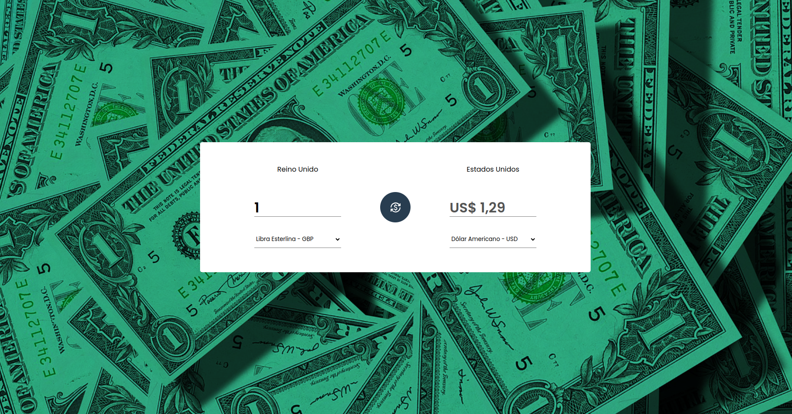

# CURRENCY CONVERSOR 

## Tecnologias utilizadas

<ul>
  <li>React</li>
  <li>Typescript</li>
  <li>Styled Components</li>
  <li>Axios</li>
  <li>entre outras...</li>
</ul>

<br>

## Pré-requisitos

Antes de executar a aplicação (caso queira criar sua própria versão), atente-se aos requisitos:
* Ter instalada a versão mais recente do `<Node.js e Yarn>`

<br>

## Executando o Projeto

Caso queira personalizar e criar sua própria versão, siga estas etapas:

1. Instale os pacotes<br>
```
>> yarn install
```
2. Agora, é só executar o comando:<br>
```
>> yarn dev
```
<br>

Para visualizar ele na web: <a href="https://currency-conversor-zeta.vercel.app/">Clique aqui!</a>

## PREVIEW



<br>
